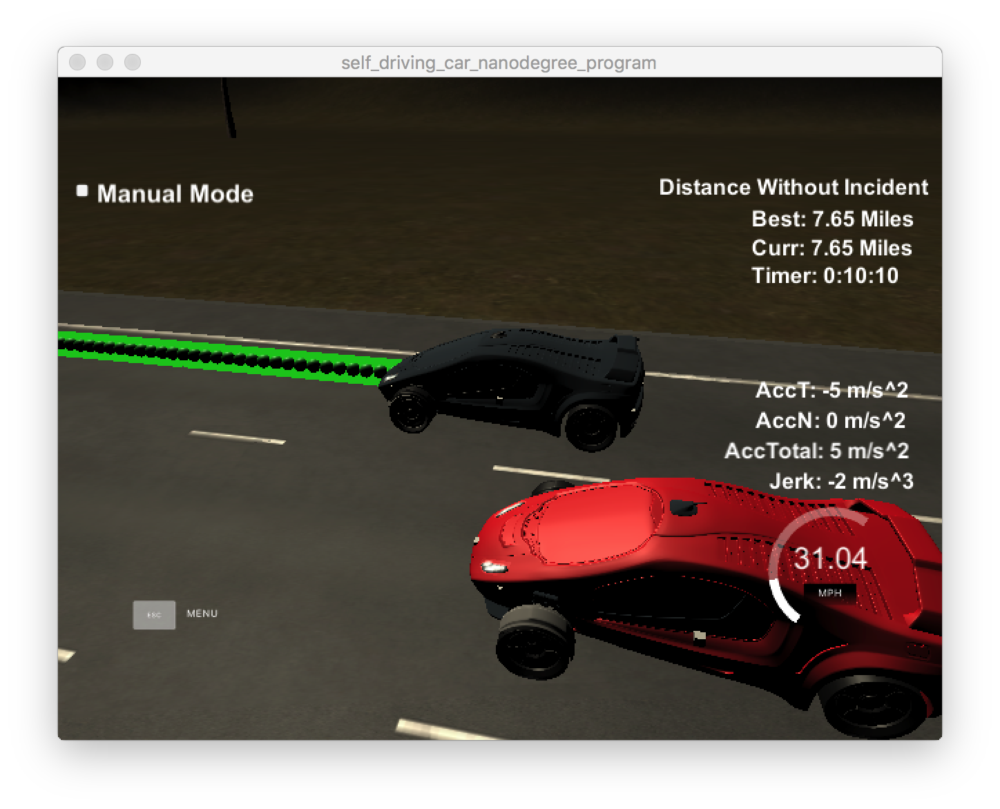

# CarND-Path-Planning-Project
Self-Driving Car Engineer Nanodegree Program

### Goals
In this project your goal is to safely navigate around a virtual highway with other traffic that is driving +-10 MPH of the 50 MPH speed limit. You will be provided the car's localization and sensor fusion data, there is also a sparse map list of waypoints around the highway. The car should try to go as close as possible to the 50 MPH speed limit, which means passing slower traffic when possible, note that other cars will try to change lanes too. The car should avoid hitting other cars at all cost as well as driving inside of the marked road lanes at all times, unless going from one lane to another. The car should be able to make one complete loop around the 6946m highway. Since the car is trying to go 50 MPH, it should take a little over 5 minutes to complete 1 loop. Also the car should not experience total acceleration over 10 m/s^2 and jerk that is greater than 10 m/s^3.

---

## Dependencies

* cmake >= 3.5
  * All OSes: [click here for installation instructions](https://cmake.org/install/)
* make >= 4.1
  * Linux: make is installed by default on most Linux distros
  * Mac: [install Xcode command line tools to get make](https://developer.apple.com/xcode/features/)
  * Windows: [Click here for installation instructions](http://gnuwin32.sourceforge.net/packages/make.htm)
* gcc/g++ >= 5.4
  * Linux: gcc / g++ is installed by default on most Linux distros
  * Mac: same deal as make - [install Xcode command line tools]((https://developer.apple.com/xcode/features/)
  * Windows: recommend using [MinGW](http://www.mingw.org/)
* [uWebSockets](https://github.com/uWebSockets/uWebSockets)
  * Run either `install-mac.sh` or `install-ubuntu.sh`.
  * If you install from source, checkout to commit `e94b6e1`, i.e.
    ```
    git clone https://github.com/uWebSockets/uWebSockets 
    cd uWebSockets
    git checkout e94b6e1
    ```

## Rubric Points

###Compilation

the project could be complied and built completely with Cmake and make, without any error.

###Valid Trajectories

####The car is able to drive at least 4.32 miles without incident.

Here I tested with the simlator and the car could drive at least 7.65 miles without indicent.



####The car drives according to the speed limit.

The car drives within 50 mph during the driving.

####Max Acceleration and Jerk are not Exceeded.

The car never reach the max acceleration (10m/s^2) and jerk (10m/s^3) during driving.

####Car does not have collisions

The car didn't collide other cars during testing.

####The car stays in its lane, except for the time between changing lanes.

This item could be satisfied during testing.

#### the car is able to change lanes

This item could be satisfied during testing.

### Reflection
Based on the orginal code provided by tutors in classroom, the algorithm was in main.cpp, from line 205 - 442.

The implementation could be described as:

####1. find other cars from sensor fusion [line 253 to line 296](./src/main.cpp#L253)
The algorithm extracted the other car's s and d from sensor fusion, and judge that: Is there a blocking car in front of us, or a blocking car prevent us to change left or right.

From the d value of other cars, we can find out which lane is it on, and to check it's s and ego car's s value, we can judget whether it will prevent us go straight, change left or change right. We choose 30m as the safety distance.

####2. Manuver Logic [line 299 to line 314](./scr/main.cpp#L299)

Based on the previous step, we have found which lane is safe to drive, so in this section, we just change to the safe lane, if all lanes are not safe, we will keep on current lane and slow down. 

And here I set the boundary speed, to keep ego car not exceed the speed limit and not stop totally (on highway it's also not safe).

####3. Trajectory generation[line 325 to line 434](./scr/main.cpp#L325)
This code section are almost same with the code provide by the tutor in the class.

To be brief, we use last two points of the previous trajectory in conjunction three points at a far distance to initialize the spline calculation. Then caculate the rest points by spline to make the trajectory more smooth.


